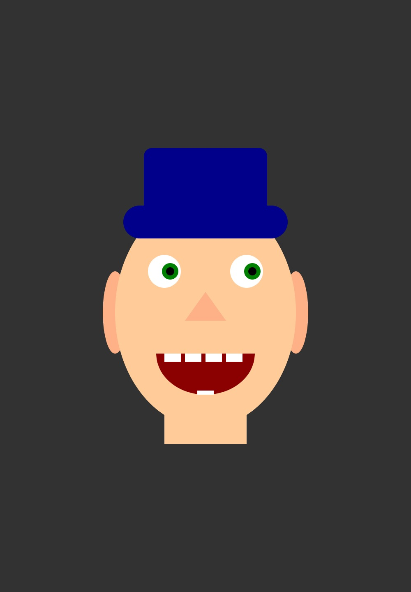

# Aufgabe 1 - Gesicht

Erstellen Sie ein mit Hilfe der p5-Standardfunktionen (z.B. ellipse, rect, etc.) ein Gesicht \
Abgabe: Quellcode, Screenshot \
Ordner: CC-SS22/<nachname-vorname>/01-portrait

### Abgabe-Screenshot:

