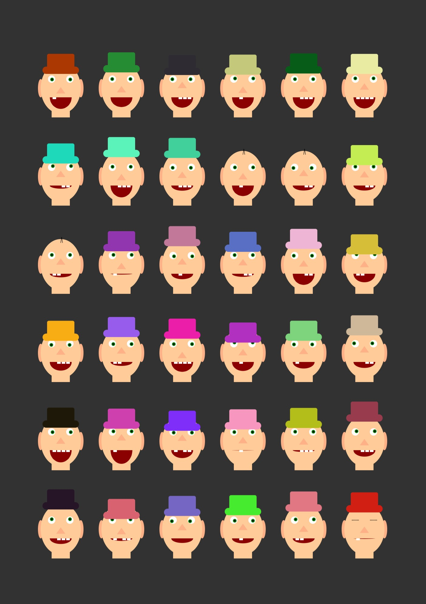

# Aufgabe 2 - Variationen / Grid

Erstellen Sie mit Hilfe von Schleifen ein Grid mit unterschiedlichen Variationen des in Aufgabe 1 erstellten Gesichts.

Abgabe: Quellcode, Screenshot(s)

Ordner: CC-SS22/<nachname-vorname>/02-face-grid

### Abgabe-Screenshot:

