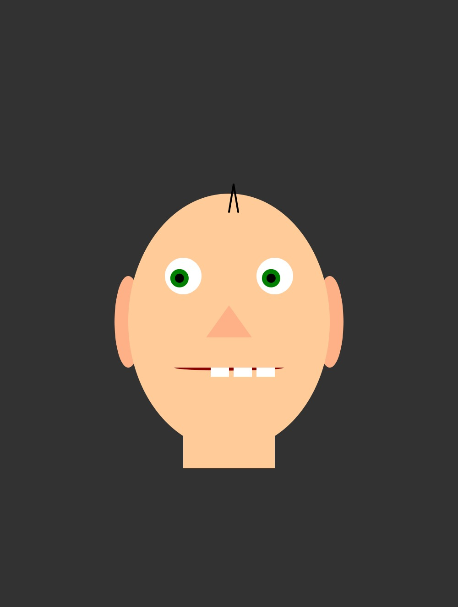

# Aufgabe 3 - Gesicht (OOP)

Das erstellte Gesicht aus Aufgabe 1 soll mit der Zuhilfenahme von Klassen objektorientiert programmiert werden.

Abgabe: Quellcode, Screenshot(s)

Ordner: CC-SS22/<nachname-vorname>/03-gesicht-oop

### Abgabe-Screenshot:

