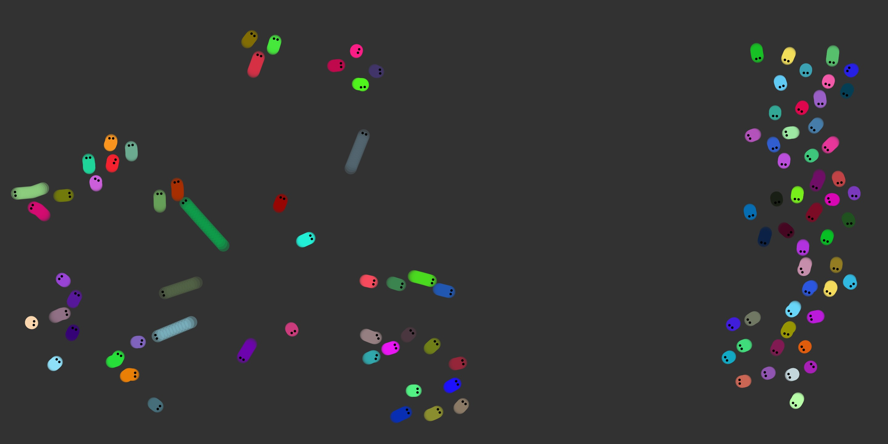
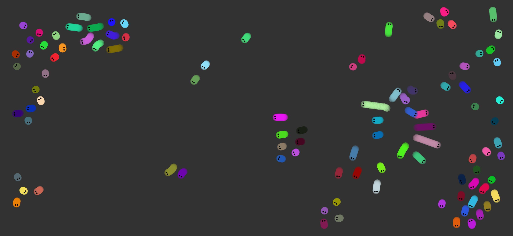

# Aufgabe 4 - Agenten

Programmieren Sie Agenten, die sich autonom verhalten und sich über die Zeichenfläche bewegen.

Abgabe: Quellcode, Screenshot(s)

Ordner: CC-SS22/<nachname-vorname>/04-agents

### Abgabe-Screenshot:

