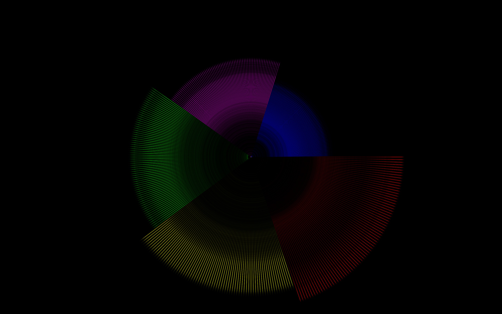
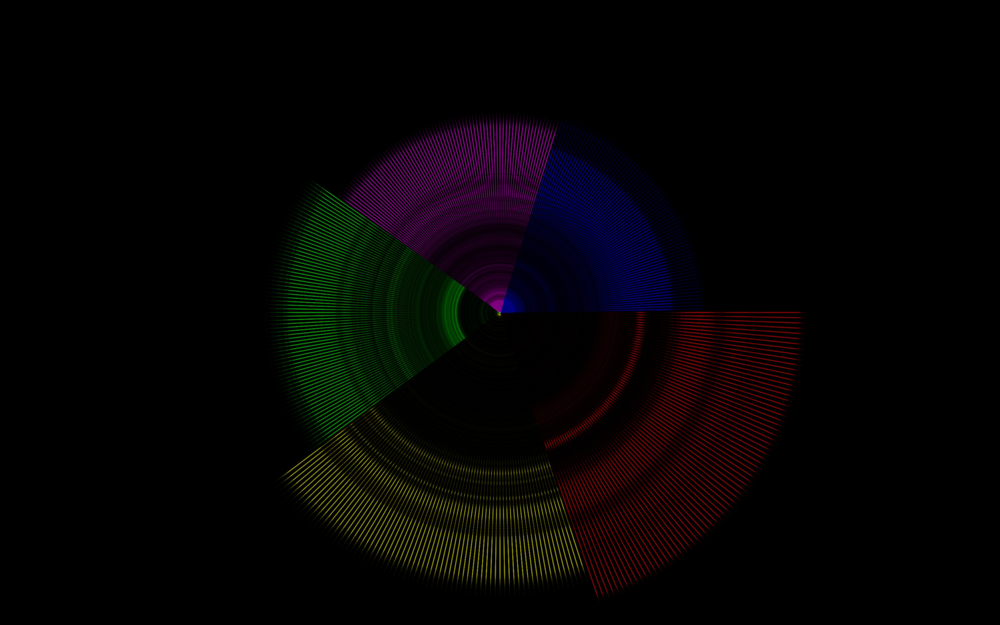

# Aufgabe 5 - Poster

Visualisieren Sie mit der Bibliothek „p5.sound” eins (oder mehrere) der folgenden Lieder auf einem Poster:

* Junior Senior - Move your feet
* Daft Punk - One More Time
* Rihanna feat. Jay-Z - Umbrella
* Right Said Fred - You're My Mate
* 50 Cent - In Da Club
* Scissor Sisters – I Don’t Feel Like Dancin’
* Justin Timberlake – Sexy Back

Abgabe: Quellcode, mindestens ein Poster im Format der Vorlage (A1 - Vorlage im _files Ordner in Aufgabe 5)

Ordner:  CC-SS22/<nachname-vorname>/05-poster

### Abgabe-Screenshot:

50_cent_-_in_da_club.mp3

daft_punk_-_one_more_time.mp3
