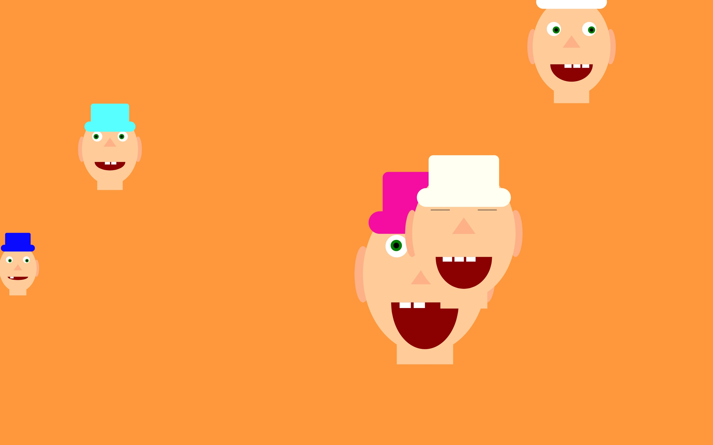

# Aufgabe 6 - Live Visualisierung

Erstellen Sie eine Live-Visualisierung eines beliebigen Songs, die mindestens drei Szenen beinhaltet, zwischen denen
gewechselt wird.

Abgabe: Quellcode

Ordner:  CC-SS22/<nachname-vorname>/06-live

### Abgabe-Screenshots

Scene 1

Scene 2

Scene 3
